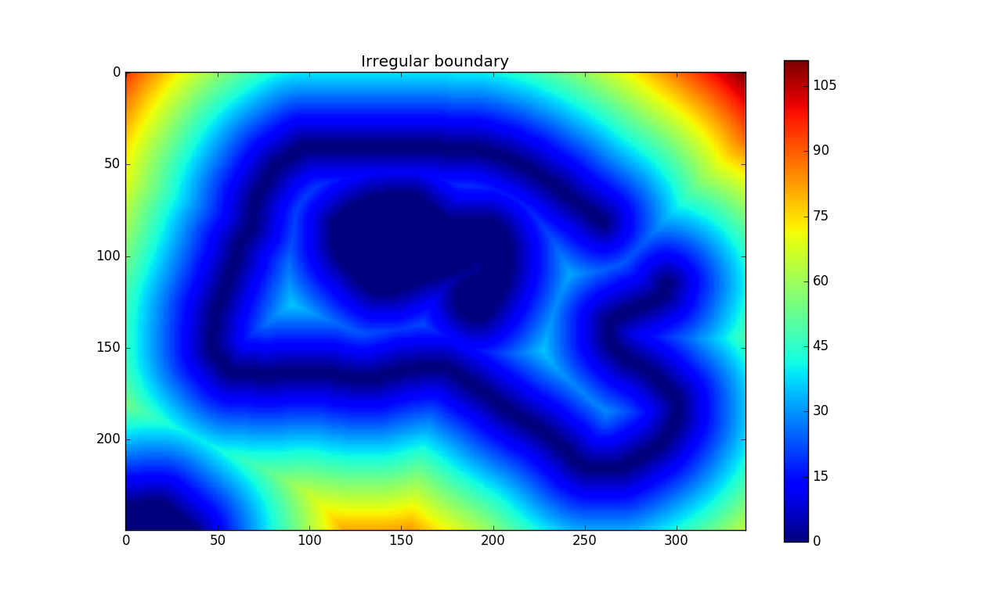

# pyfmm
Python module implementing the Fast Marching Method, written in pure Python. Only dependency is numpy 1.8+.

The implementation uses mostly boolean arrays for accessing and updating values. Instead of accepting only the smallest value at each iteration (step 3, https://en.wikipedia.org/wiki/Fast_marching_method), one may accept an arbitrary number of values at each step. This can speed up the computations considerably, but may in some cases be inaccurate (especially if the speed varies alot).

## Installation

```
pip install pyfmm
```

## Interface

There are two ways to compute the distances: 

a) Using a boolean array that specifies the exact points that defines the boundary,

b) Using an array of known distances to the boundary, in addition to a boolean array marking which values are certain.

Method a)
```python
import pyfmm, numpy

my_boundary = numpy.array(..., dtype=numpy.bool)  # All boundary points marked as "True"
solution = pyfmm.march(my_boundary)
```

Method b)
```python
import pyfmm, numpy

known_distances = np.array(...)  # Unknown values could for instance be set to np.inf
solution = pyfmm.march(numpy.argwhere(known_distances != numpy.inf), known_distances))
```

The number of values that are accepted at each iteration can be set using `batch_size`, and an array of speeds can be given using `speed`.

## Examples

The examples illustrate the following:

* `circle.py`: Distance from a ring boundary in the upper left part of the image. `batch_size` is varied to see how it affects computation time and result. In this case, the difference between the results from `batch_size=1` and `batch_size=100` seems negligible.
* `race_to_middle.py`: Straight boundary on left and right hand side, and two different `speed` fields. The examples illustrates what might happen if care is not taken when choosing a `batch_size`.
* `irregular.py`: Simply a less regular boundary shape than the two above.

The example boundary defined by examples/irregular_boundary.png:


